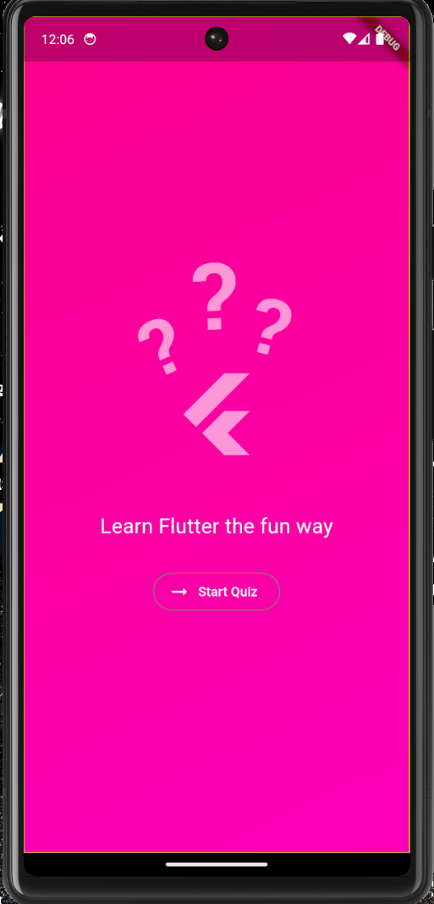

# Flutter Quiz App

Welcome to the **Flutter Quiz App**! This interactive quiz application, built with Flutter, offers a dynamic quiz experience with multiple screens, question navigation, and a final result summary. Test your knowledge while learning Flutter!

---

## Features

- **Start Screen**: Welcoming intro with a start button.
- **Question Navigation**: Move seamlessly through questions.
- **Result Summary**: View a detailed breakdown of your answers, including correct and incorrect responses, with an option to restart the quiz.

---

## Built With

- **Flutter**: For cross-platform mobile development.
- **Dart**: Programming language for Flutter.
- **Google Fonts**: Lato and RobotoMono fonts for a clean, modern look.

---

## Screenshots

## Screenshots

## Screenshots

| Start Screen | Question Screen | Result Screen |
|--------------|-----------------|---------------|
|  |  |  |


---

## Getting Started

To get a local copy of the app up and running, follow these steps.

### Prerequisites

- **Flutter SDK**
- **Dart**

### Installation

1. **Clone the repository**:
   ```bash
   git clone https://github.com/KaranKhandekar1729/Quiz-App.git
   ```
2. **Navigate the project directory**:
   ```bash
   cd quizapp
   ```
3. **Install dependencies**:
   ```bash
   flutter pub get
   ```
4. **Run the app**:
   ```bash
   flutter run
   ```

## Usage

1. Click **Start Quiz** to begin.
2. Navigate through each question by selecting your answer.
3. Once all questions are answered, view your **Result Summary**.
4. Click **Restart Quiz** to play again.

## Contributing
Contributions are what make the open-source community such a great place to learn, inspire, and create. Any contributions you make are **greatly appreciated!**

1. **Fork the Project**
2. **Create your Feature Branch** (`git checkout -b feature/AmazingFeature`)
3. **Commit your Changes** (`git commit -m 'Add some AmazingFeature'`)
4. **Push to the Branch** (`git push origin feature/AmazingFeature`)
5. **Open a Pull Request**

## Contact
Karan Khandekar - karankhandekar028@gmail.com

Project Link: https://github.com/KaranKhandekar1729/Quiz-App

